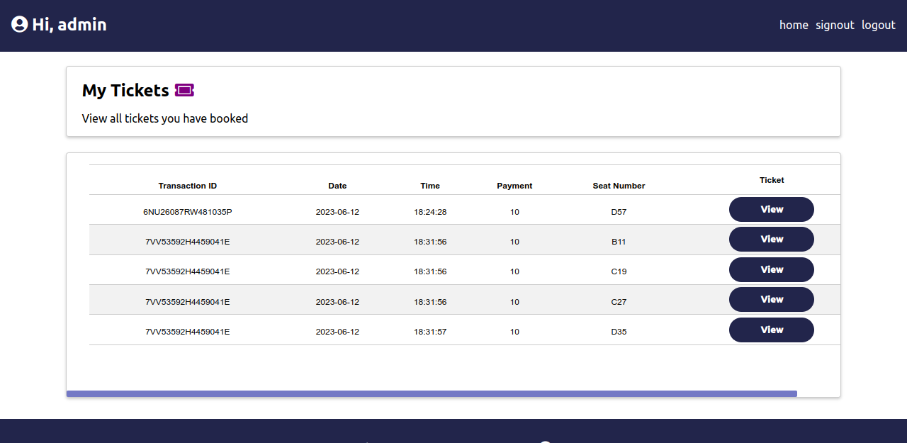
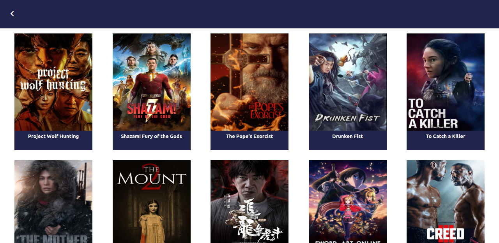
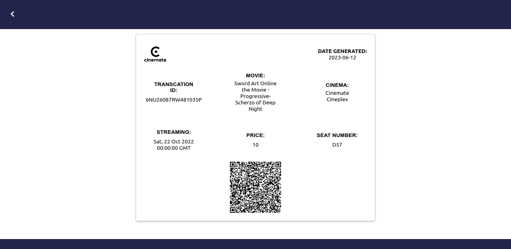
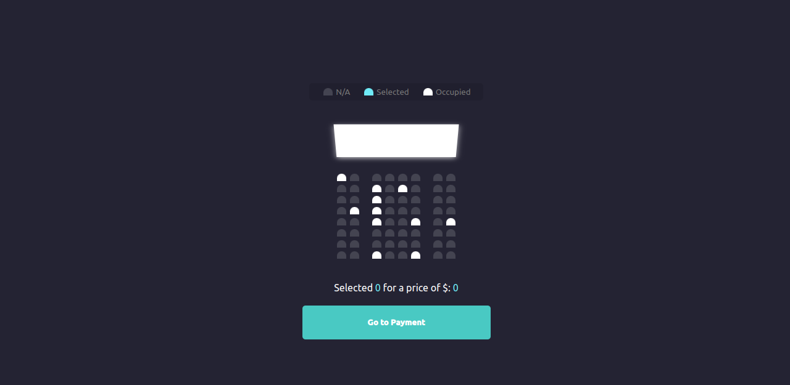
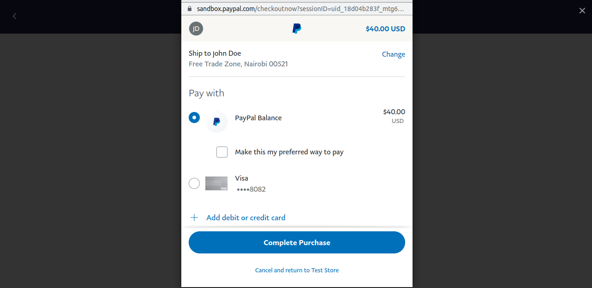

<h1>Cinemate</h1>

<p>The Ticket Booking App is a web-based application that enables users to easily book tickets for movies. It provides a user-friendly interface for movie selection, seat reservation, and secure booking.</p>

<h2>Technologies Used</h2>

<ul>
  <li>HTML5</li>
  <li>CSS3</li>
  <li>React.js</li>
  <li>Sqlite</li>
  <li>Flask</li>
</ul>

<h2>Folder Structure</h2>

<p>The project folder structure is organized as follows:</p>

<ul>
  <li><code>client</code>: Contains the client-side code (React components, styles, and assets).</li>
  <li><code>server</code>: Contains the server-side code (API routes, database models, and controllers).</li>
</ul>

<h2>Usage</h2>

<p>Follow the instructions below to use the Ticket Booking App:</p>

1. Clone the repository:
   ```bash
   git clone https://github.com/KingHawkins/cinemate.git
   ```
2. Install the dependencies for the client-side:
    ```bash
    cd client
    npm install
    ```
3. Install the dependencies for the server-side:
    ```bash
    cd server
    pip install -r requirements.txt
    ```
4. Start the development server for the server-side:
     ```bash
     python3 -m server.app
     sudo apt-get install redis-server or visit https://redis.io/download
     ```
6. Start redis-server and the rq worker:
    ```bash
    cd server
    redis-server
    rq worker redis://localhost:6379 emails
    ```
5. Start the development server for the client-side:
      ```bash
      cd client
      npm start
      ```
6. For payments, please do not use your real paypal account. Use your developer sandbox paypal account instead. Use the buyer email i.e ..........@personal.com..If an error occurs, then open PayPalButton.jsx and edit the client_id. Replace it with your sandbox client id. Edit the `payee`, replace it with your sandbox business account i.e ....@business.com...To avoid surprises, make sure you have enough dummy money in your sandbox personnal account &#128512;.
<ol>
  <li>Open your web browser and visit http://localhost:3000 to access the app.</li>
  <li>Register a new account or log in with existing credentials.</li>
  <li>Browse the available movies and select a movie.</li>
  <li>Choose the desired seats from the interactive seating chart.</li>
  <li>Enter your details and confirm the booking.</li>
  <li>Receive a confirmation email with the ticket details.</li>
  <li>Access the user dashboard to view booking history and manage account information.</li>
  <li>The API Documentation can be accessed at <code>http://127.0.0.1:5000/api/swagger-ui</code></li>
</ol>
<h2>Example</h2>





<h2>Contributing</h2>

<p>Contributions are welcome! If you have any suggestions, bug reports, or feature requests, please open an issue or submit a pull request.</p>

<h2>License</h2>

<p>This project is licensed under the <a href="LICENSE">MIT License</a>.</p>

<h2>Contact</h2>

<p>For any inquiries or support, please contact me at kinghawkins61@gmail.com</p>